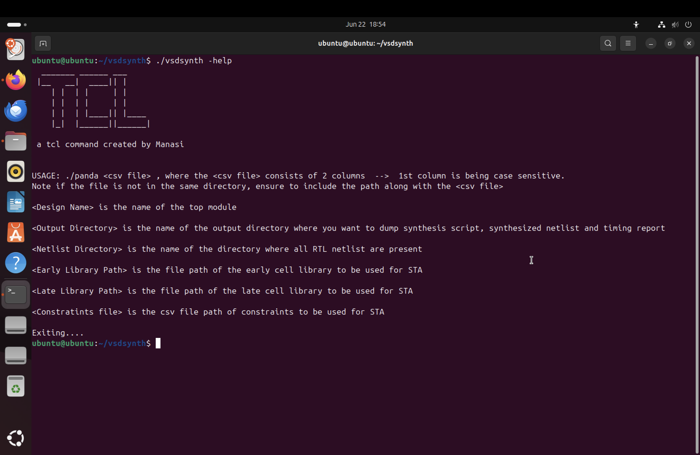

# Comprehensive TCL Workshop: From Introduction to Advanced Scripting Techniques in Design and Synthesis
--------------------------------------------------------------------------------------------------------


## Introduction
Tool Command Language (Tcl) is a versatile scripting language widely employed in the field of VLSI (Very Large Scale Integration) design to automate and control Electronic Design Automation (EDA) tools. It serves as the primary interface for interacting with these tools, enabling engineers to efficiently manage complex design flows.

This project focuses on creating a TCL tool which takes a .csv file as an input and outputs a datasheet with the STA analysis for the design. The .csv file has a directory containing all the source files, the .lib files and design constraints file. 

The Tasks include: 

__-Create a command ( ./vsdsynth) which helps to transfer the .csv file from the UNIX shell to TCL script._
__-Convert to format[1] and SDC format. Format[1] is readable by yosys tool._
__-Convert to format[2] and .timing format to pass to Opentimer tool._
__-Outputs a performance chart_


## DAY-1

__Create Command (panda) and pass csv file from UNIC shell to Tcl script__

The command was created with the following algorithm:
1) Letting the system know that its a UNIX script

```
#!/bin/tcsh -f  
```

2) Creating the logo

```
echo "  _______ ______ ___      "
echo " |__   __|  ____|| |     "
echo "    | |  | |     | |     "
echo "    | |  | |     | |     "
echo "    | |  | |____|| |____ "
echo "    |_|  |______||______|"

 
echo 
echo " a tcl command created by Manasi  "          

```


3) Verifying three general scenarios for a user POV
  - user doesnt enter the csv file


  - user enters the wrong csv file/ file doesnt exist


  - user enters __-help__




4) Source the Unix shell to the Tcl script by passing the required csv file 

```
tclsh vsdsynth.tcl $argv[1] 
```
Explanations for general scenarios from user point of view: 

__-No file passed__
The $#argv gets the number of arguments passed to the command vsdsynth. If it is not equal to 1, a error message is displayed on the shell to provide the csv file. 

__-.csv file does not exsist__
An if else loop is used to check for a condition which is true and enters the loop if the the file is not found or if the argument is –help. If the argument is not equal to –help, an error message saying “Cannot find csv file” is printed; else, the correct usage is printed on the shell.  

__-.csv file passed to the command__ 
It goes to the tclsh vsdsynth.tcl $argv[1] line in the last else block and executes the script. 

 

## DAY-2
__Converting inputs to format[1] and feeding it to yosys for synthesis__

  __- Create Variables__


  __- Checking if the directories exist or not_


Displays an error when the required file is not in the needed directory


## DAY-3

__Read Constraints.csv file and convert to sdc format__

  - getting clock details from csv file and writing it the sdc file in the required format
  - getting input details from csv file and writing it in the required format
  - getting output details from csv file and writing it in the required format
 
Note: We need to identify bussed and non bussed inputs and outputs before entering in the required format.

The script writing the sdc constraints.


A snip of the sdc file 


## DAY-4

### YOSYS (Yosys Open SYnthesis Suite)
Yosys is an open-source tool for RTL synthesis and formal verification of digital circuits. It takes RTL designs, such as Verilog files, and converts them into gate-level netlists through synthesis. Yosys also supports technology mapping, various optimizations, and formal verification tasks. With its powerful scripting interface and ability to integrate with other EDA tools, Yosys has become a popular choice for both academic research and industry use in digital design workflows.

__Creating scripts for synthesis and running it on yosys__

  - Creating script for Hierarchy check
  - Running hierarchy check


## DAY-5

__Create script for OpenTimer, Run STA analysis followed by generation of Quality of Results (QoR)__

_An introduction to procs_
To generate a script for OpenTimer, I will make use of procs. Procs are external Tcl files that define reusable operations, similar to functions in Python. When these proc files are sourced into the main Tcl script, their commands can be called with specific arguments.

For example, a proc like read_liberty <args> can accept options such as -lib, -late, -early, and <filename>. Once the proc is sourced, invoking read_liberty within the main script will execute the corresponding logic defined in the proc file, with the provided arguments correctly mapped. After the proc command runs, the main script continues with the output or effect generated by that proc.


__- Entering the world of procs__
1) reopenStdout.proc

```
proc reopenStdout {file} {
  #closes the main terminal window where all the puts statements were being displayed as info to user
  close stdout
  #opens $file in write mode
  open $file w       
}
```
The reopenStdout proc is a proc which is used to redirect the stdout from the terminal to the "file" which is the argument to the proc.

2) set_num_threads.proc
   
```      
proc set_multi_cpu_usage {args} {
    array set options {-localCpu <num_of_threads> -help "" }
    foreach {switch value} [array get options] {
    puts "Option $switch is $value"
    }
    while {[llength $args]} {
    puts "llength is [llength $args]"
    puts "lindex 0 of \"$args\" is [lindex $args 0]"
        switch -glob -- [lindex $args 0] {
          -localCpu {
              puts "old args is $args"
              set args [lassign $args - options(-localCpu)]
              puts "new args is \"$args\""
              puts "set_num_threads $options(-localCpu)"
              }
          -help {
              puts "old args is $args"
              set args [lassign $args - options(-help) ]
              puts "new args is \"$args\""
              puts "Usage: set_multi_cpu_usage -localCpu <num_of_threads>"
              }
        }
    }
}
```
The line array set options { -localCpu <num_of_threads> -help "" } creates an array called options, where each entry is a key-value pair. In this case, -localCpu is linked to <num_of_threads>, and -help is linked to an empty string. The line switch -glob -- [lindex $args 0] uses globbing to match the first argument in the list, allowing switch to identify which case to process based on the option provided. Finally, set args [lassign $args - options(-localCpu)] updates args by removing the processed option and its value, so the loop can move on to the next argument.

        


3) read_lib.proc

```
proc read_lib args {
	array set options {-late <late_lib_path> -early <early_lib_path> -help ""}
	while {[llength $args]} {
		switch -glob -- [lindex $args 0] {
		-late {
			set args [lassign $args - options(-late) ]
			puts "set_late_celllib_fpath $options(-late)"
		      }
		-early {
			set args [lassign $args - options(-early) ]
			puts "set_early_celllib_fpath $options(-early)"
		       }
		-help {
			set args [lassign $args - options(-help) ]
			puts "Usage: read_lib -late <late_lib_path> -early <early_lib_path>"
			puts "-late <provide late library path>"
			puts "-early <provide early library path>"
		      }	
		default break
		}
	}
}
```
Similar to the set_num_threads proc, the read_lib proc is designed to handle three options: -late, -early, and -help. This proc takes care of reading both the late and early library files required for STA, and writes the necessary information to the appropriate file for further processing.
 

4) read_verilog.proc

```
proc read_verilog arg1 {
  puts "set_verilog_fpath $arg1"
}
```
This proc enters the puts statement followed by the netlist file


5) read_sdc.proc

The read_sdc proc is a large proc file which will be covered in parts.
This is done to convert sdc file into OpenTimer format
```
proc read_sdc {arg1} {
set sdc_dirname [file dirname $arg1]
#"file tail" is used to get the last file of the arguement given
set sdc_filename [lindex [split [file tail $arg1] .] 0 ]
#set sdc_filename [lindex [split [lindex [split $arg1 /] [expr {[llength [split $arg1 /]] -1}]] .] 0]
set sdc [open $arg1 r]
set tmp_file [open ./temp/4 "w"] 
puts -nonewline $tmp_file [string map {"\[" "" "\]" " "} [read $sdc]]     
close $tmp_file
}
```

We start by setting the directory and filename for the SDC file, and then create a temporary file where we replace any square brackets ([ and ]) with empty strings to simplify the content. A special mapping is also applied to help the script correctly distinguish between similar names, like abc and abc_en, ensuring accurate processing. You can refer to the corresponding block of code for more details on how this is handled.


- converting create_clock constraints
```
set tmp_file [open /tmp/4 r]
set timing_file [open /tmp/3 w]
set lines [split [read $tmp_file] "\n"]
set find_clocks [lsearch -all -inline $lines "create_clock*"]
foreach elem $find_clocks {
	set clock_port_name [lindex $elem [expr {[lsearch $elem "get_ports"]+1}]]
	set clock_period [lindex $elem [expr {[lsearch $elem "-period"]+1}]]
	set duty_cycle [expr { 100 - [expr {[lindex [lindex $elem [expr {[lsearch $elem "-waveform"]+1}]] 1]*100/$clock_period}]}]
	puts $timing_file "clock $clock_port_name $clock_period $duty_cycle"
	}
close $tmp_file
```

Just like we identified create_clock constraints, we locate set_clock_latency constraints by searching for lines containing set_clock_latency. In a similar manner, we process and write constraints for set_clock_transition, set_input_delay, set_input_transition, set_output_delay, and set_load. Once all these constraints are handled, we close the timing file. Finally, to ensure that all bussed inputs and outputs have consistent constraints applied to each individual pin, we use additional logic in the code to systematically map these constraints across the bus signals.

- creating clock_latency constraints
```
set find_keyword [lsearch -all -inline $lines "set_clock_latency*"]
#puts $find_keyword
set tmp2_file [open ./temp/5 "w"]
set new_port_name ""
foreach elem $find_keyword {
        set port_name [lindex $elem [expr {[lsearch $elem "-clock"]+1}]]
        #puts "b = $port_name"
        #puts "c = $new_port_name"
	    if {![string match $new_port_name $port_name]} {
        	set new_port_name $port_name 
        	set delays_list [lsearch -all -inline $find_keyword [join [list "*" " " $port_name " " "*"] ""]]
            #puts "d = $delays_list"
        	set delay_value ""
        	foreach new_elem $delays_list {
        		set port_index [lsearch $new_elem "-clock"]
        		lappend delay_value [lindex $new_elem [expr {$port_index-1}]]
			#puts "e= $delay_value"
        	}
		puts -nonewline $tmp2_file "\nat $port_name $delay_value"
	}
}

close $tmp2_file
set tmp2_file [open ./temp/5 ]
puts -nonewline $timing_file [read $tmp2_file]
close $tmp2_file
```
- similar to finding create_clock constraints , clock_latency constraints are found by grepping for "set_clock_latency"
- similarly the constraints for "set_clock_transition", "set_input_delay", "set_input_transition", "set_output_delay" and "set_load" are written in same fashion
- after which the timing file is closed.
- now we need to make sure that all bussed inputs and outputs receive the same constraints on each pin. hence we make use of the following code
```
set ot_timing_file [open $sdc_dirname/$sdc_filename.timing w]
set timing_file [open /tmp/3 r]
while {[gets $timing_file line] != -1} {
        if {[regexp -all -- {\*} $line]} {
                set bussed [lindex [lindex [split $line "*"] 0] 1]
                set final_synth_netlist [open $sdc_dirname/$sdc_filename.final.synth.v r]
                while {[gets $final_synth_netlist line2] != -1 } {
                        if {[regexp -all -- $bussed $line2] && [regexp -all -- {input} $line2] && ![string match "" $line]} {
                        puts -nonewline $ot_timing_file "\n[lindex [lindex [split $line "*"] 0 ] 0 ] [lindex [lindex [split $line2 ";"] 0 ] 1 ] [lindex [split $line "*"] 1 ]"
                        } elseif {[regexp -all -- $bussed $line2] && [regexp -all -- {output} $line2] && ![string match "" $line]} {
                        puts -nonewline $ot_timing_file "\n[lindex [lindex [split $line "*"] 0 ] 0 ] [lindex [lindex [split $line2 ";"] 0 ] 1 ] [lindex [split $line "*"] 1 ]"
                        }
                }
        } else {
        puts -nonewline $ot_timing_file  "\n$line"
        }
}

close $timing_file
puts "set_timing_fpath $sdc_dirname/$sdc_filename.timing"
}
```
We begin by opening the final timing file in write mode. Next, we open the temporary timing file in read mode to identify and process the bussed ports. To ensure all bus signals are properly constrained, we read through the synthesis netlist and locate all nets that belong to a bus. These are then written to the final timing file in the required format, applying the constraints to each port within the bus. If we encounter any lines that correspond to non-bussed signals, we simply write them as they are into the final timing file, preserving their original details.


now we have reached the end of the read_sdc. proc
Now all the procs need to be sourcd so that they can be called in the main file.

```
puts "\nInfo: Timing Analysis Started ... "
puts "\nInfo: initializing number of threads, libraries, sdc, verilog netlist path..."
source /home/vsduser/vsdsynth/procs/reopenStdout.proc
source /home/vsduser/vsdsynth/procs/set_num_threads.proc
reopenStdout $OutputDirectory/$DesignName.conf
set_multi_cpu_usage -localCpu 8

source /home/vsduser/vsdsynth/procs/read_lib.proc
read_lib -early /home/vsduser/vsdsynth/osu018_stdcells.lib

read_lib -late /home/vsduser/vsdsynth/osu018_stdcells.lib

source /home/vsduser/vsdsynth/procs/read_verilog.proc
read_verilog $OutputDirectory/$DesignName.final.synth.v

source /home/vsduser/vsdsynth/procs/read_sdc.proc
read_sdc $OutputDirectory/$DesignName.sdc
reopenStdout /dev/tty
```

__Creating the spef file and config file__


```
- logs and results are saved in the file $DesignName.results
- encountered an error where a string variable was being assigned either a null value or was bveing initialised incorrectly. It was rectified when the sdc file, __final.synth.v file__ ( string issue was from this file) and conf file was checked for errors.

Now we take the outputs of STA analysis from the .results file 
```
#-------------------------find worst output violation--------------------------------#
set worst_RAT_slack "-"
set report_file [open $OutputDirectory/$DesignName.results r]
set pattern {RAT}
while {[gets $report_file line] != -1} {
	if {[regexp $pattern $line]} {
		set worst_RAT_slack "[expr {[lindex $line 3]/1000}]ns"
		break
	} else {
		continue
	}
}
close $report_file

#-------------------------find number of output violations--------------------------------#	
set report_file [open $OutputDirectory/$DesignName.results r]
set count 0
while {[gets $report_file line] != -1} {
	incr count [regexp -all -- $pattern $line]
}
set Number_output_violations $count
close $report_file

#-------------------------find worst setup violation--------------------------------#
set worst_negative_setup_slack "-"
set report_file [open $OutputDirectory/$DesignName.results r] 
set pattern {Setup}
while {[gets $report_file line] != -1} {
	if {[regexp $pattern $line]} {
		set worst_negative_setup_slack "[expr {[lindex $line 3]/1000}]ns"
		break
	} else {
		continue
	}
}
close $report_file

#-------------------------find number of setup violations--------------------------------#
set report_file [open $OutputDirectory/$DesignName.results r]
set count 0
while {[gets $report_file line] != -1} {
	incr count [regexp -all -- $pattern $line]
}
set Number_of_setup_violations $count
close $report_file

#-------------------------find worst hold violation--------------------------------#
set worst_negative_hold_slack "-"
set report_file [open $OutputDirectory/$DesignName.results r] 
set pattern {Hold}
while {[gets $report_file line] != -1} {
	if {[regexp $pattern $line]} {
		set worst_negative_hold_slack "[expr {[lindex $line 3]/1000}]ns"
		break
	} else {
		continue
	}
}
close $report_file

#-------------------------find number of hold violations--------------------------------#
set report_file [open $OutputDirectory/$DesignName.results r]
set count 0
while {[gets $report_file line] != -1} {
	incr count [regexp -all -- $pattern $line]
}
set Number_of_hold_violations $count
close $report_file

#-------------------------find number of instances--------------------------------#

set pattern {Num of gates}
set report_file [open $OutputDirectory/$DesignName.results r] 
while {[gets $report_file line] != -1} {
	if {[regexp $pattern $line]} {
		set Instance_count "[lindex [join $line " "] 4 ]"
		break
	} else {
		continue
	}
}
close $report_file
```

Once all the output data is extracted from the .results file, it is formatted into a datasheet and displayed in the terminal window.


```
puts "\n"
puts "						****PRELAYOUT TIMING RESULTS**** 					"
set formatStr "%15s %15s %15s %15s %15s %15s %15s %15s %15s"

puts [format $formatStr "----------" "-------" "--------------" "---------" "---------" "--------" "--------" "-------" "-------"]
puts [format $formatStr "DesignName" "Runtime" "Instance Count" "WNS Setup" "FEP Setup" "WNS Hold" "FEP Hold" "WNS RAT" "FEP RAT"]
puts [format $formatStr "----------" "-------" "--------------" "---------" "---------" "--------" "--------" "-------" "-------"]
foreach design_name $DesignName runtime $time_elapsed_in_sec instance_count $Instance_count wns_setup $worst_negative_setup_slack fep_setup $Number_of_setup_violations wns_hold $worst_negative_hold_slack fep_hold $Number_of_hold_violations wns_rat $worst_RAT_slack fep_rat $Number_output_violations {
	puts [format $formatStr $design_name $runtime $instance_count $wns_setup $fep_setup $wns_hold $fep_hold $wns_rat $fep_rat]
}

puts [format $formatStr "----------" "-------" "--------------" "---------" "---------" "--------" "--------" "-------" "-------"]
puts "\n"

```

The variable formatStr uses %15s as a string formatting identifier, which ensures that each string passed to it is automatically aligned and spaced uniformly to a width of 15 characters. This provides a clean, tabular appearance for the output. A foreach loop is then used to pass the relevant output values into formatStr, allowing the script to neatly generate and display the datasheet in a structured format.


_Acknowledgements: TCL Workshop by [Mr. Kunal Ghosh](https://github.com/kunalg123) , [VLSI System Design](https://www.vlsisystemdesign.com/)_


